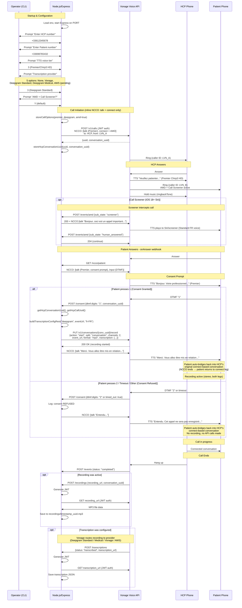

# Call Flow Diagram

```mermaid
sequenceDiagram
    participant Operator as Operator (CLI)
    participant Server as Node.js/Express
    participant Vonage as Vonage Voice API
    participant HCP as HCP Phone
    participant Patient as Patient Phone

    Note over Operator,Server: Startup & Configuration
    Server->>Server: Load env, start Express on PORT
    Server->>Operator: Prompt "Enter HCP number"
    Operator->>Server: +33612345678
    Server->>Operator: Prompt "Enter Patient number"
    Operator->>Server: +33698765432
    Server->>Operator: Prompt "TTS voice tier"
    Operator->>Server: 3 (Premier/Chirp3 HD)
    Server->>Operator: Prompt "Transcription provider"
    Note over Operator,Server: 5 options: None, Vonage,<br/>Deepgram Standard, Deepgram Medical, AWS (pending)
    Operator->>Server: 3 (Deepgram Standard)
    Server->>Operator: Prompt "AMD + Call Screener?"
    Operator->>Server: Y (default)

    Note over Server,Vonage: Call Initiation (inline NCCO: talk + connect only)
    Server->>Server: storeCallOptions(premier, deepgram, amd=true)
    Server->>Vonage: POST /v1/calls (JWT auth)<br/>NCCO: [talk (Premier), connect + AMD]<br/>to: HCP, from: LVN_A
    Vonage-->>Server: {uuid, conversation_uuid}
    Server->>Server: storeHcpConversationUuid(uuid, conversation_uuid)
    Vonage->>HCP: Ring (caller ID: LVN_A)

    Note over HCP,Vonage: HCP Answers
    HCP->>Vonage: Answer
    Vonage->>HCP: TTS "Veuillez patienter..." (Premier Chirp3 HD)
    Vonage->>Patient: Ring (caller ID: LVN_B)<br/>AMD + Call Screener active
    Vonage->>HCP: Hold music (ringbackTone)

    opt Call Screener (iOS 18+ Siri)
        Note over Patient,Server: Screener intercepts call
        Vonage->>Server: POST /events/amd {sub_state: "screener"}
        Server->>Vonage: 200 + NCCO [talk "Bonjour, ceci est un appel important..."]
        Vonage->>Patient: TTS plays to Siri/screener (Standard FR voice)
        Vonage->>Server: POST /events/amd {sub_state: "human_answered"}
        Server->>Vonage: 204 (continue)
    end

    Note over Patient,Server: Patient Answers - onAnswer webhook
    Patient->>Vonage: Answer
    Vonage->>Server: GET /ncco/patient
    Server->>Vonage: NCCO: [talk (Premier, consent prompt), input (DTMF)]

    Note over Patient,Vonage: Consent Prompt
    Vonage->>Patient: TTS "Bonjour. Votre professionnel..." (Premier)

    alt Patient presses 1 (Consent Granted)
        Patient->>Vonage: DTMF "1"
        Vonage->>Server: POST /consent {dtmf.digits: "1", conversation_uuid}
        Server->>Server: getHcpConversationUuid(), getHcpCallUuid()
        Server->>Server: buildTranscriptionConfigRest("deepgram", eventUrl, "fr-FR")
        Server->>Vonage: PUT /v1/conversations/{conv_uuid}/record<br/>{action: "start", split: "conversation", channels: 2,<br/>event_url, format: "mp3", transcription: {...}}
        Vonage-->>Server: 200 OK (recording started)
        Server->>Vonage: NCCO: [talk "Merci. Vous allez être mis en relation..."]
        Vonage->>Patient: TTS "Merci. Vous allez être mis en relation..."

        Note over HCP,Patient: Patient auto-bridges back into HCP's<br/>original connect-based conversation<br/>(NCCO ends → patient returns to connect leg)

        Note over HCP,Patient: Recording active (stereo, both legs)
    else Patient presses 2 / Timeout / Other (Consent Refused)
        Patient->>Vonage: DTMF "2" or timeout
        Vonage->>Server: POST /consent {dtmf.digits: "2" or timed_out: true}
        Server->>Server: Log: consent REFUSED
        Server->>Vonage: NCCO: [talk "Entendu..."]
        Vonage->>Patient: TTS "Entendu. Cet appel ne sera pas enregistré..."
        Note over HCP,Patient: Patient auto-bridges back into HCP's<br/>connect-based conversation<br/>No recording, no API calls made
    end

    Note over HCP,Patient: Call in progress
    HCP->>Patient: Connected conversation

    Note over HCP,Patient: Call Ends
    HCP->>Vonage: Hang up
    Vonage->>Server: POST /events {status: "completed"}

    opt Recording was active
        Vonage->>Server: POST /recordings {recording_url, conversation_uuid}
        Server->>Server: Generate JWT
        Server->>Vonage: GET recording_url (JWT auth)
        Vonage->>Server: MP3 file data
        Server->>Server: Save to recordings/timestamp_uuid.mp3
    end

    opt Transcription was configured
        Note over Vonage,Server: Vonage routes recording to provider<br/>(Deepgram Standard / Medical / Vonage / AWS)
        Vonage->>Server: POST /transcriptions<br/>{status: "transcribed", transcription_url}
        Server->>Server: Generate JWT
        Server->>Vonage: GET transcription_url (JWT auth)
        Server->>Server: Save transcription JSON
    end
```
