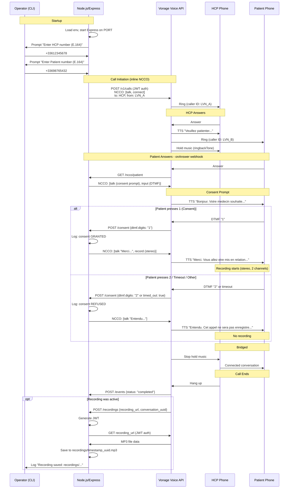

# Call Flow Diagram

```mermaid
sequenceDiagram
    participant Operator as Operator (CLI)
    participant Server as Node.js/Express
    participant Vonage as Vonage Voice API
    participant HCP as HCP Phone
    participant Patient as Patient Phone

    Note over Operator,Server: Startup
    Server->>Server: Load env, start Express on PORT
    Server->>Operator: Prompt "Enter HCP number (E.164)"
    Operator->>Server: +33612345678
    Server->>Operator: Prompt "Enter Patient number (E.164)"
    Operator->>Server: +33698765432

    Note over Server,Vonage: Call Initiation (inline NCCO)
    Server->>Vonage: POST /v1/calls (JWT auth)<br/>NCCO: [talk, connect]<br/>to: HCP, from: LVN_A
    Vonage->>HCP: Ring (caller ID: LVN_A)

    Note over HCP,Vonage: HCP Answers
    HCP->>Vonage: Answer
    Vonage->>HCP: TTS "Veuillez patienter..."
    Vonage->>Patient: Ring (caller ID: LVN_B)
    Vonage->>HCP: Hold music (ringbackTone)

    Note over Patient,Server: Patient Answers - onAnswer webhook
    Patient->>Vonage: Answer
    Vonage->>Server: GET /ncco/patient
    Server->>Vonage: NCCO: [talk (consent prompt), input (DTMF)]

    Note over Patient,Vonage: Consent Prompt
    Vonage->>Patient: TTS "Bonjour. Votre medecin souhaite..."

    alt Patient presses 1 (Consent)
        Patient->>Vonage: DTMF "1"
        Vonage->>Server: POST /consent {dtmf.digits: "1"}
        Server->>Server: Log: consent GRANTED
        Server->>Vonage: NCCO: [talk "Merci...", record (stereo)]
        Vonage->>Patient: TTS "Merci. Vous allez etre mis en relation..."
        Note over HCP,Patient: Recording starts (stereo, 2 channels)
    else Patient presses 2 / Timeout / Other
        Patient->>Vonage: DTMF "2" or timeout
        Vonage->>Server: POST /consent {dtmf.digits: "2" or timed_out: true}
        Server->>Server: Log: consent REFUSED
        Server->>Vonage: NCCO: [talk "Entendu..."]
        Vonage->>Patient: TTS "Entendu. Cet appel ne sera pas enregistre..."
        Note over HCP,Patient: No recording
    end

    Note over HCP,Patient: Bridged
    Vonage->>HCP: Stop hold music
    HCP->>Patient: Connected conversation

    Note over HCP,Patient: Call Ends
    HCP->>Vonage: Hang up
    Vonage->>Server: POST /events {status: "completed"}

    opt Recording was active
        Vonage->>Server: POST /recordings {recording_url, conversation_uuid}
        Server->>Server: Generate JWT
        Server->>Vonage: GET recording_url (JWT auth)
        Vonage->>Server: MP3 file data
        Server->>Server: Save to recordings/timestamp_uuid.mp3
        Server->>Operator: Log "Recording saved: recordings/..."
    end
```
