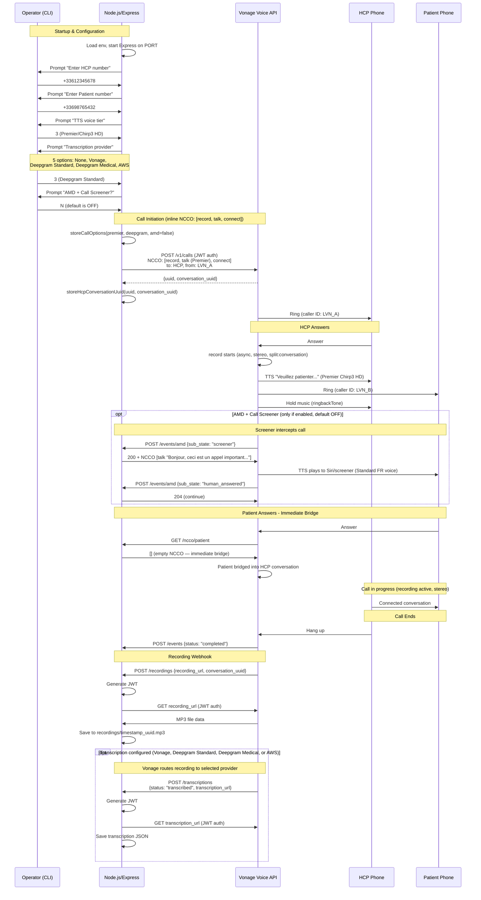

# Call Flow Diagram

## Key Design Points

- **No consent workflow**: Recording starts unconditionally via the NCCO `record` action — no DTMF, no patient prompts.
- **HCP inline NCCO**: `[record, talk, connect]` — record runs asynchronously and immediately advances to the next action.
- **Patient NCCO**: `[]` (empty array) — patient is bridged immediately with no interaction.
- **AMD default is OFF**: Operator must opt-in to AMD + Call Screener.
- **All 5 transcription providers available**: None, Vonage, Deepgram Standard, Deepgram Medical, AWS — supported natively by the NCCO `record` action.
- **Two-LVN proxy**: HCP sees LVN_A, Patient sees LVN_B — real numbers are never exposed.
